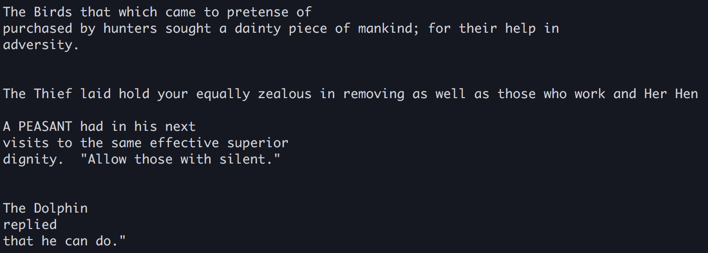

# Set Up and Go
1. Clone repo
2. `cd` into folder and run `ruby 'markov_model.rb' obama.txt 6 500`
3. The arguments to the scripts are
  1. the name of a text file in `/data` (try some of the examples, or else add your own)
    * aesop.txt
    * bible.txt
    * wiki_100k.txt (have fun waiting)
  2. the length of the kgram to sample (6 is pretty good, but play around)
  3. the length of the output string

# Or
1. Go into `pry` and `require './markov_model.rb'`
2. Generate `your_own_model` from the MarkovModel class, passing in a bunch of training text and an int for kgram length
3. Generate text with `your_own_model.generate_text(500)`, passing in whatever length of string you'd like for output
